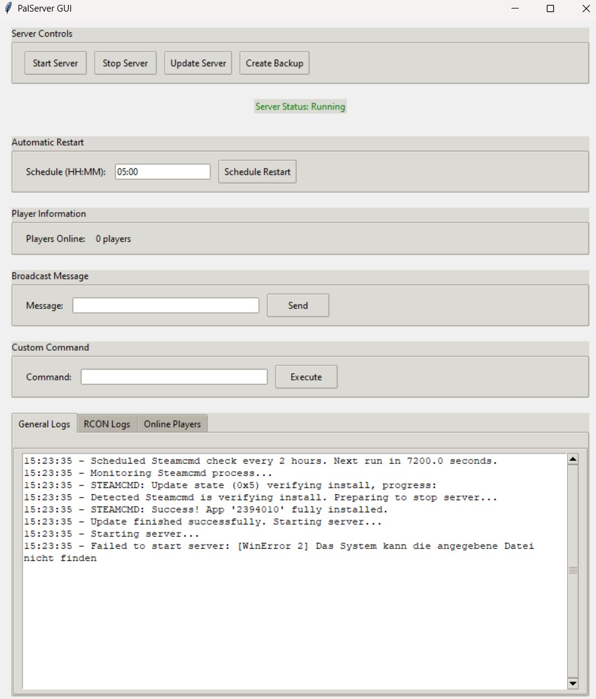

# This is a simple Steam Dedicated Server GUI fully coded with local AI in Visual Studio Code with Cline.

I use it for my Palworld server; that's why there is written PalServer GUI, but I think it can be used for many more dedicated servers that use RCON to communicate with the server. 

Eventually you need to edit the player count function or some others slightly to use it for your dedicated server. 

# How to run the Steam Dedicated Server GUI

Read the Usage Instructions before and edit the `steam_server_gui_improved.py` with your pathes.

You can run it via Python, or make an .exe out of it with `pyinstaller`.

PyInstaller is easy to install with `pip install pyinstaller`.

After it use the command `pyinstaller --onefile steam_server_gui_improved.py` in the directy where the steam_server_gui_improved.py is saved on your device.

Run the steam_server_gui_improved.exe in the `dist` directory. 




# PalServer GUI - README

## Introduction
The PalServer GUI is a Python-based graphical user interface designed to manage dedicated servers for Steam games, with specific configurations for Palworld. This tool simplifies server management by providing an easy-to-use interface for starting, stopping, updating, and backing up your game server.

## Prerequisites
Before using the GUI, make sure you have installed:
- Python 3.x (ensure `tkinter` module is available)
- Required libraries: `mcrcon`, `subprocess`, `threading`, `time`, `datetime`, `os`, and `shutil`

You can install required packages with pip if necessary:
```bash
pip install mcrcon
```

## Functions Overview

### `run_command(command)`
Executes a shell command and captures the output. Used for running external commands like SteamCMD.

### `send_rcon_command(command)`
Sends a Remote Console (RCON) command to the server and logs the response. Utilized for server administration tasks.

### `create_backup()`
Creates a backup of the save games directory with timestamped folders. Ensures game progress is preserved before updates or changes.

### `update_server_status(status)`
Updates the server status label in the GUI, changing color based on the current status (e.g., Running, Stopped).

### `check_server_and_restart()`
Monitors the server process and restarts it if it crashes. Runs in a separate thread for continuous monitoring.

### `start_server()`
Starts the dedicated server by launching its executable. Also sets up monitoring to ensure stability.

### `stop_server()`
Stops the server gracefully using RCON commands, saving progress before shutdown.

### `update_server()`
Updates the server using SteamCMD with validation and backup steps. Automatically restarts the server after a successful update.

### `schedule_restart(hour, minute)`
Schedules automatic server restarts at specified times. Useful for regular maintenance or updates.

### `monitor_steamcmd_process()`
Monitors the SteamCMD process for specific keywords indicating progress or completion of updates.

### `schedule_steamcmd_check()`
Schedules automatic checks of SteamCMD updates every 2 hours to ensure the server stays up-to-date.

## Configuration
Before running the GUI, update the following constants in the script with your actual paths and credentials:

```python
# Constants (update these with actual paths and credentials)
SERVER_EXE_PATH = r"path_to_your_server.exe"
STEAMCMD_PATH = r"path_to_steamcmd.exe"
SAVE_GAMES_DIR = r"path_to_save_games_directory"
BACKUP_DIR = r"path_to_backup_directory"

RCON_PORT = portnumber
RCON_PASSWORD = "your_rcon_password"
RCON_IP = "localhost"
```

## Usage Instructions

### Starting the GUI
1. Open a terminal and navigate to the directory containing `steam_server_gui_improved.py`.
2. Run the script using Python:
   ```bash
   python steam_server_gui_improved.py
   ```

### Using the Interface
- **Start Server**: Click "Start Server" to launch the dedicated server.
- **Stop Server**: Click "Stop Server" to gracefully shut down the server.
- **Update Server**: Click "Update Server" to check for updates and apply them using SteamCMD.
- **Create Backup**: Click "Create Backup" to backup your game saves to a specified directory.
- **Schedule Restart**: Enter an HH:MM time in the "Automatic Restart" section and click "Schedule Restart" to set up automatic restarts.

### Sending Broadcast Messages
1. Enter a message in the "Broadcast Message" field.
2. Click "Send" to broadcast the message to all players on the server.

### Executing Custom Commands
1. Enter an RCON command in the "Custom Command" field.
2. Click "Execute" to send the command directly to your server via RCON.

## Customization for Different Games

To use this GUI with other Steam games, update the constants with paths and credentials specific to that game:
- `SERVER_EXE_PATH`: Path to the executable of the dedicated server for the chosen game.
- `STEAMCMD_PATH`: Path to your SteamCMD installation.
- `SAVE_GAMES_DIR` and `BACKUP_DIR`: Directories for save games and backups respectively.

Ensure RCON settings (`RCON_PORT`, `RCON_PASSWORD`, `RCON_IP`) are updated according to the server's requirements.

## Troubleshooting

### Common Issues
1. **Server Not Starting**: Ensure the paths in the constants are correct, and that you have sufficient permissions.
2. **Update Failed**: Check network connectivity and ensure SteamCMD is properly configured.
3. **RCON Commands Fail**: Verify RCON settings (`RCON_PORT`, `RCON_PASSWORD`) match your server configuration.

### Reading Logs
The GUI provides multiple tabs for logs:
- General Logs: Output from various functions, including errors and status updates.
- RCON Logs: Responses to RCON commands sent by the user or the system.
- Online Players: Lists players currently connected to the server.

Review these logs for detailed debugging information.

## Automatic Server Restart

One key feature of this GUI is its ability to automatically restart the server if it crashes. The function `check_server_and_restart()` monitors the server process continuously. If it detects that the server has crashed (i.e., the process is no longer running), it will:
1. Log an error message indicating the server has crashed.
2. Wait for a short period before attempting to restart to prevent rapid cycling in case of repeated crashes.
3. Restart the server using the same executable path defined by `SERVER_EXE_PATH`.
4. Send an RCON command to get server info after restarting, and update player count.

This feature ensures that your server stays online even if it encounters issues, providing a more stable experience for players.

## Conclusion
The PalServer GUI provides a streamlined way to manage your dedicated game servers on Steam. With clear interfaces and automated features like automatic restarts upon crashing, it reduces the complexity of maintaining servers, allowing you to focus on gameplay.
